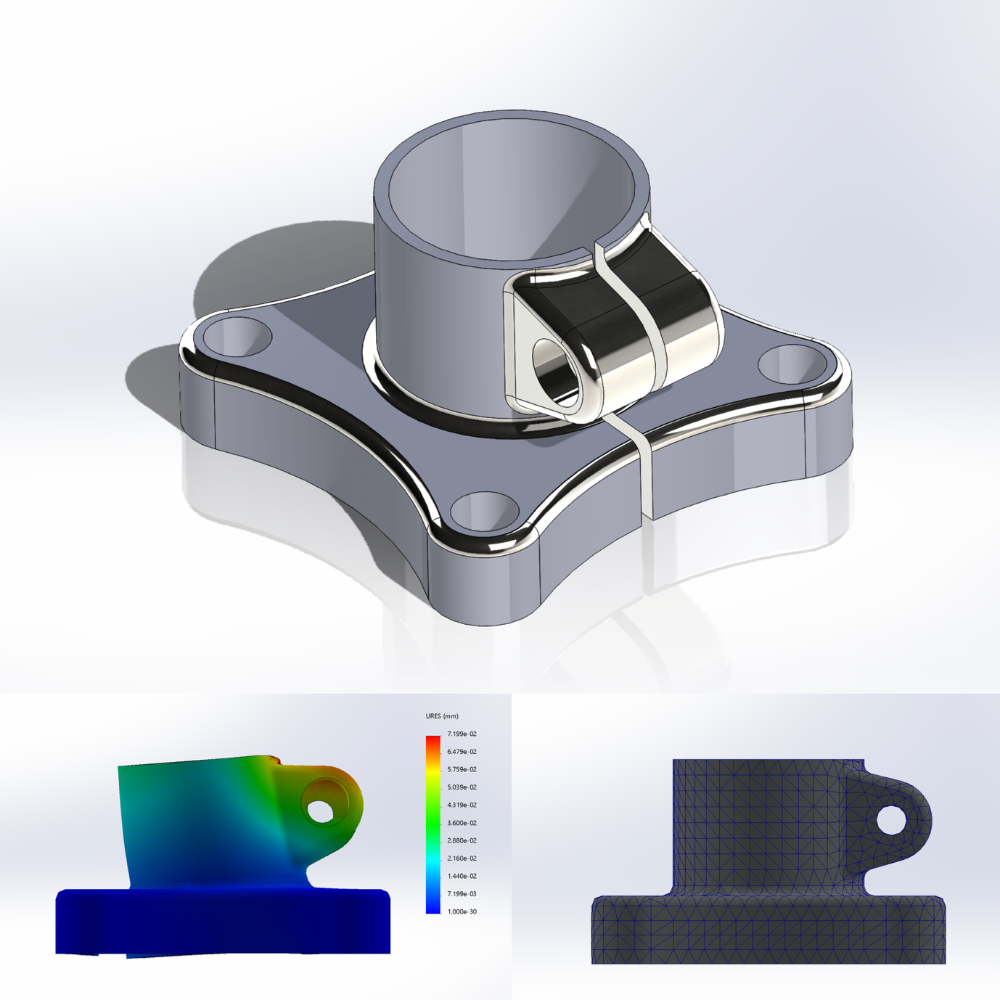

**<u>Static Structural Analysis (Learning Exercise)</u>**

By – Tejas

<tejas.bishnoi.0001@gmail.com>

[Link to Source](https://github.com/TejasBishnoi/Mechanical-Engineering-design-simulation-log/tree/main/Model_mania_Study_21)

``` math
\mathbf{PURPOSE\ AND\ SCOPE}
```

This study was conducted as an early learning exercise to understand as well as learn the complete workflow of CAD modelling and basic finite element analysis using **<u>SolidWorks Simulation.</u>**

The primary focus of this work is not to derive a result, but to gain hands-on experience with:

- Learning to model in SolidWorks

- Understanding Stress, Displacement, and the Factor of Safety Result.

- Interpreting simulation output.

- Post Processing

- And also writing this report.

This is a simplified static analysis done mainly for learning purposes. A few assumptions were made to simplify the setup. The results should be seen as an understanding exercise, not a final or industry-ready analysis.

**<u>CAD MODEL OVERVIEW</u>**

The CAD model used in this study was created by me based on a part from **SolidWorks Model Mania 2021**. The model was recreated using the provided CAD drawing, following the given dimensions and geometric features.

> 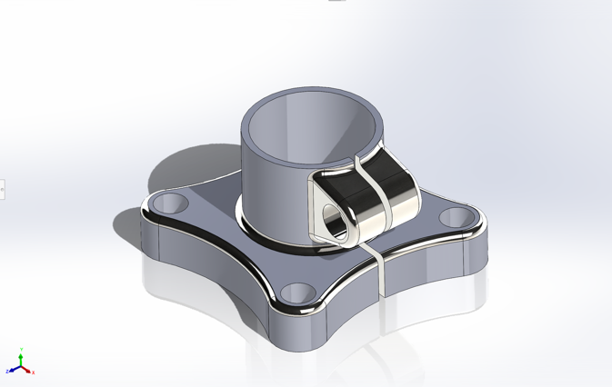 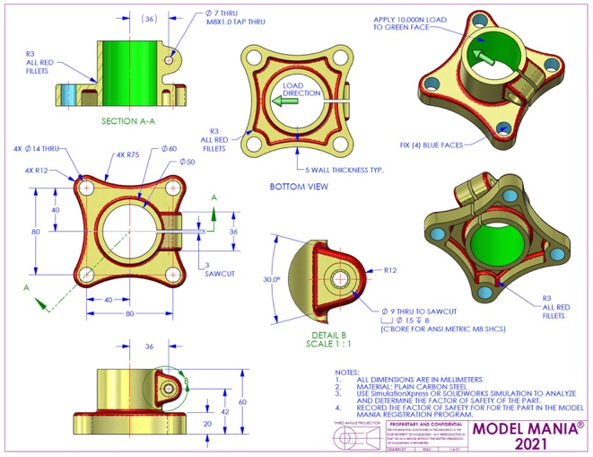

The purpose of modelling this part was to practice accurate CAD creation from a technical drawing and then use the same model to explore basic structural simulation in SolidWorks Simulation. The geometry includes features such as extrusions, cuts, fillets, and mounting holes, which make it suitable for observing stress concentration and deformation behaviour.

The model was not modified or optimised for real-world use and was kept as per the reference drawing to focus on learning both CAD interpretation and simulation setup.

- **<u>Some Basic Information about the cad model and the model used for the simulation:</u>**

<table style="width:100%;">
<colgroup>
<col style="width: 33%" />
<col style="width: 33%" />
<col style="width: 33%" />
</colgroup>
<thead>
<tr>
<th style="text-align: center;"><strong>Document Name and Reference</strong></th>
<th style="text-align: center;"><strong>Treated As</strong></th>
<th style="text-align: center;"><strong>Volumetric Properties</strong></th>
</tr>
</thead>
<tbody>
<tr>
<td style="text-align: center;"><p><strong>CBORE for M8 SHCS2</strong></p>
<p></p></td>
<td style="text-align: center;"><strong>Solid Body</strong></td>
<td style="text-align: center;"><p><strong>Mass:</strong>0.878176 <strong>kg</strong></p>
<p><strong>Volume:</strong>0.000112587 <strong>m^3</strong></p>
<p><strong>Density:</strong>7,800 <strong>kg/m^3</strong></p>
<p><strong>Weight:</strong>8.60613 <strong>N</strong></p></td>
</tr>
</tbody>
</table>

*<u>\*Generated by SolidWorks Report</u>*

Material Properties

<table>
<colgroup>
<col style="width: 47%" />
<col style="width: 52%" />
</colgroup>
<thead>
<tr>
<th style="text-align: center;"><strong>Model Reference</strong></th>
<th style="text-align: center;"><strong>Properties</strong></th>
</tr>
</thead>
<tbody>
<tr>
<td>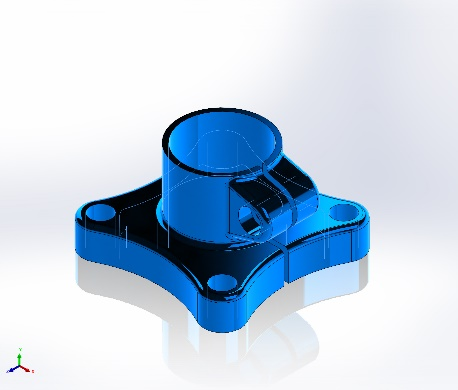</td>
<td><table style="width:50%;">
<colgroup>
<col style="width: 24%" />
<col style="width: 25%" />
</colgroup>
<tbody>
<tr>
<td style="text-align: right;"><strong>Name:</strong></td>
<td>Plain Carbon Steel</td>
</tr>
<tr>
<td style="text-align: right;"><strong>Model type:</strong></td>
<td>Linear Elastic Isotropic</td>
</tr>
<tr>
<td style="text-align: right;"><strong>Default failure criterion:</strong></td>
<td>Unknown</td>
</tr>
<tr>
<td style="text-align: right;"><strong>Yield strength:</strong></td>
<td>2.20594e+08 N/m^2</td>
</tr>
<tr>
<td style="text-align: right;"><strong>Tensile strength:</strong></td>
<td>3.99826e+08 N/m^2</td>
</tr>
<tr>
<td style="text-align: right;"><strong>Elastic modulus:</strong></td>
<td>2.1e+11 N/m^2</td>
</tr>
<tr>
<td style="text-align: right;"><strong>Poisson's ratio:</strong></td>
<td>0.28</td>
</tr>
<tr>
<td style="text-align: right;"><strong>Mass density:</strong></td>
<td>7,800 kg/m^3</td>
</tr>
<tr>
<td style="text-align: right;"><strong>Shear modulus:</strong></td>
<td>7.9e+10 N/m^2</td>
</tr>
<tr>
<td style="text-align: right;"><strong>Thermal expansion coefficient:</strong></td>
<td>1.3e-05 /Kelvin</td>
</tr>
</tbody>
</table></td>
</tr>
</tbody>
</table>

*<u>\*Generated by SolidWorks Report</u>*

**<u>Some Terms and Prerequisites</u>**

For a static study of a model, we need to define some Fixtures (Fixed Points: points that might be pinned to a support or nailed down, etc., aka the points that won’t move under load) and Load Points(Points where the said load will be applied)

These can be singular or multiple points. In this case, we have used 4 Fixtures(4 Screw posts), and the centre will experience the load.

*<u>Fixture:</u>*

<table>
<colgroup>
<col style="width: 33%" />
<col style="width: 33%" />
<col style="width: 33%" />
</colgroup>
<thead>
<tr>
<th style="text-align: center;"><strong>Fixture Name</strong></th>
<th style="text-align: center;"><strong>Fixture Image</strong></th>
<th style="text-align: center;"><strong>Fixture Details</strong></th>
</tr>
</thead>
<tbody>
<tr>
<td>Fixed-1</td>
<td></td>
<td><p>Entities: 4Face(s)</p>
<p>Type: Fixed</p>
<p>Geometry</p></td>
</tr>
</tbody>
</table>

*<u>\*Generated by SolidWorks Report</u>*

*<u>Load:</u>*

<table>
<colgroup>
<col style="width: 31%" />
<col style="width: 35%" />
<col style="width: 32%" />
</colgroup>
<thead>
<tr>
<th style="text-align: center;"><strong>Load Name</strong></th>
<th style="text-align: center;"><strong>Load Image</strong></th>
<th style="text-align: center;"><strong>Load Detail</strong></th>
</tr>
</thead>
<tbody>
<tr>
<td style="text-align: center;">Force-1</td>
<td>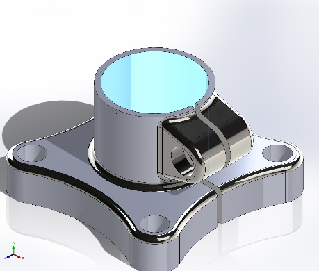</td>
<td style="text-align: center;"><p><strong>Entities:</strong> 1 face</p>
<p><strong>Reference:</strong> Edge&lt;1&gt;</p>
<p><strong>Type:</strong> Apply force</p>
<p><strong>Values:</strong> 10,000N</p>
<p><strong>Direction:</strong> Away from clamp</p></td>
</tr>
</tbody>
</table>

*<u>\*Generated By SolidWorks Report</u>*

**<u>Mesh Information</u>**

First of all, we should understand what Mesh actually is.

In a FEA(Finite Element Analysis), a mesh is the process of dividing a geometry into a large number of smaller, discrete elements. These elements are connected at points called nodes. The equations of the “Physical Problem” are solved at these nodes. Allowing the software(in this case, SolidWorks Simulations) to ~ approximate how the model will behave under the load.

So, in our case.

A solid tetrahedral mesh was used for the analysis and generated using the default meshing settings in SolidWorks. The mesh contained around 9,600 elements and 17,900 nodes. Most of the elements had a good shape, with more than 97% having a low aspect ratio and no visibly distorted elements. The mesh was kept reasonably fine so that the results would be accurate enough while still keeping the simulation time low. Since the main aim of this study was to understand the simulation process and workflow, a detailed mesh convergence study was not performed, as it was a learning journey only.

*Actual Mesh Info:*

| Mesh Type                             | Solid Mesh    |
|---------------------------------------|---------------|
| Mesher Used:                          | Standard Mesh |
| Automatic Transition:                 | Off           |
| Include Mesh Auto Loops:              | Off           |
| Jacobian points for High Quality Mesh | 16 points     |
| Element Size                          | 4.83015 mm    |
| Tolerance                             | 0.241507 mm   |
| Mesh Quality                          | High          |

*Details:*

| Total Nodes | 17909 |
|----|----|
| Total Elements | 9576 |
| Maximum Aspect Ratio | 11.703 |
| % of Elements with AR \< 3 | 97.5 |
| Percentage of elements with Aspect Ratio \> 10 | 0.0627 |
| Percentage of Distorted elements | 0 |
| Time to complete mesh (hh;mm;ss) | 00:00:03 |
| Computer Name | Macbook Pro 2019 16inch Base |

**So, what are all these titles:**

*<u>Automatic Transition</u>*: Automatic transition is the option that controls gradual element size change.

*<u>Include Mesh Auto Loops:</u>* Auto loops if turned on, refines mesh around holes and edges automatically.

*<u>Jacobian Points for high quality mesh</u>*: its checks for element distortion, in this case 16 points is good and professional

*<u>Element Size</u>*: This is the global average element edge length. The analogy is, larger element size equals to faster solve and less accurate result. And For Finer element size equals to Slower Solve and greater accuracy.

*<u>Tolerance</u>*: Tolerance controls how accurately the mesh follows the model.

*<u>Nodes</u>*: Nodes are the points at which the displacement is calculated. More nodes will mean more equations which in result means more accuracy.

*<u>Element</u>*: An Element is the smallest finite volume over which the governing equations are solved.

*<u>Aspect ratio</u>*: aspect ratio is the ratio of how stretched an element is.

**<u>Resultant Forces Experienced</u>**

This is the forces that were experienced by either the entire model or can be computed at a specific part of the model. But in our case, forces are calculated only for the entire model.

Here is the data:

*Reaction Forces:*

| **Selection Set** | **Units** | **Sum X** | **Sum Y**   | **Sum Z**   | **Resultant** |
|:------------------|:----------|:----------|:------------|:------------|:--------------|
| Entire Model      | N         | 10,000    | -6.3777e-06 | -4.8399e-05 | 10,000        |

*Reaction Moments:*

| **Selection Set** | **Units** | **Sum X** | **Sum Y** | **Sum Z** | **Resultant** |
|:------------------|:----------|:----------|:----------|:----------|:--------------|
| Entire Model      | N.m       | 0         | 0         | 0         | 0             |

*Free Body Forces:*

| **Selection Set** | **Units** | **Sum X** | **Sum Y**   | **Sum Z**    | **Resultant** |
|:------------------|:----------|:----------|:------------|:-------------|:--------------|
| Entire Model      | N         | 0.0102458 | 8.64463e-05 | -3.25556e-05 | 0.0102462     |

*Free Body Moments:*

| **Selection Set** | **Units** | **Sum X** | **Sum Y** | **Sum Z** | **Resultant** |
|:------------------|:----------|:----------|:----------|:----------|:--------------|
| Entire Model      | N.m       | 0         | 0         | 0         | 1e-33         |

**What are all these terms:**

*<u>Reaction Forces</u>*: Forces generated at constraints(aka fixtures) to satisfy equilibrium.

*<u>Reaction Moment</u>*: Moment (Rotation generated by a force along a axis) generated at fixtures to prevent rotation.

*<u>Freebody Forces</u>*: Equivalent forces acting on a isolated part of the model.

*<u>Freebody moment</u>*: Equivalent torque acting on the isolated body or face.

**<u>Study Result</u>**

This static finite element analysis was carried out to understand how the component behaves under an applied load and fixed boundary conditions. The study mainly focused on observing the stress distribution and deformation of the model rather than obtaining highly optimised or final design values. From the results, the regions experiencing higher stress were clearly visible near the constrained and load-applied areas, which is expected in a static analysis.

*Stress:*

<table>
<colgroup>
<col style="width: 25%" />
<col style="width: 25%" />
<col style="width: 25%" />
<col style="width: 25%" />
</colgroup>
<thead>
<tr>
<th><strong>Name</strong></th>
<th><strong>Type</strong></th>
<th><strong>Min</strong></th>
<th><strong>Max</strong></th>
</tr>
</thead>
<tbody>
<tr>
<td>Stress</td>
<td>VON: von Mises Stress</td>
<td><p>1.535e+05 N/m^2</p>
<p>Node: 183</p></td>
<td><p>1.322e+08 N/m^2</p>
<p>Node: 13195</p></td>
</tr>
</tbody>
</table>

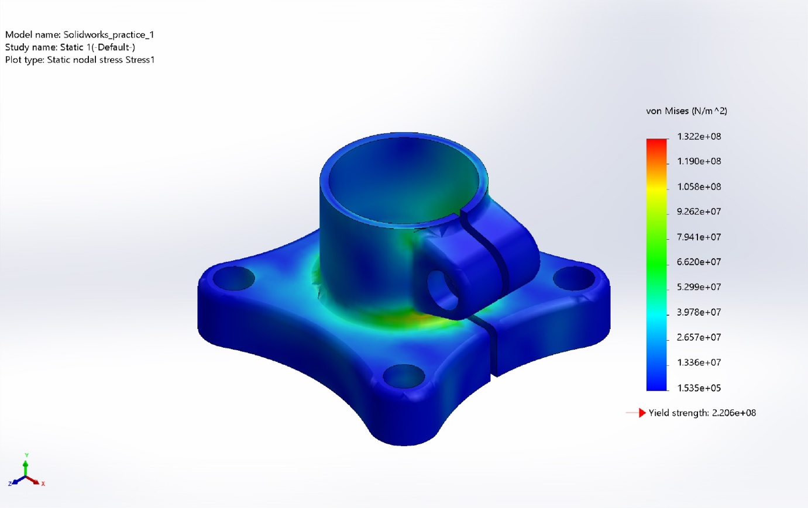

Static Stress

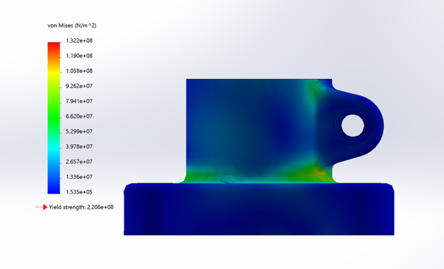

*Displacement:*

<table>
<colgroup>
<col style="width: 25%" />
<col style="width: 25%" />
<col style="width: 25%" />
<col style="width: 25%" />
</colgroup>
<thead>
<tr>
<th><strong>Name</strong></th>
<th><strong>Type</strong></th>
<th><strong>Min</strong></th>
<th><strong>Max</strong></th>
</tr>
</thead>
<tbody>
<tr>
<td>Displacement</td>
<td>URES: Resultant Displacement</td>
<td><p>0.000e+00 mm</p>
<p>Node: 550</p></td>
<td><p>7.199e-02mm</p>
<p>Node: 2239</p></td>
</tr>
</tbody>
</table>

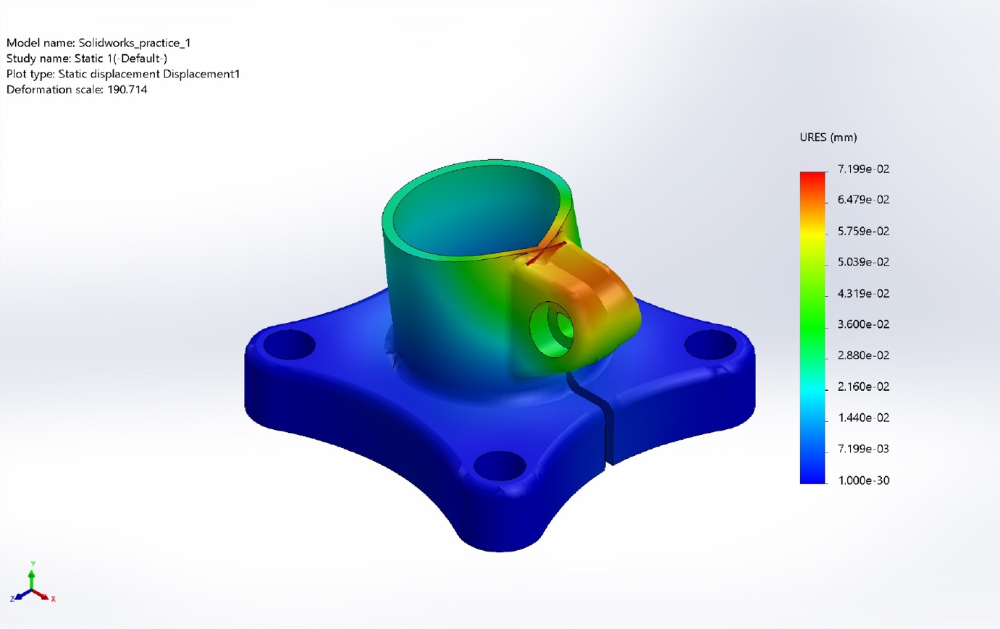

Static Displacement

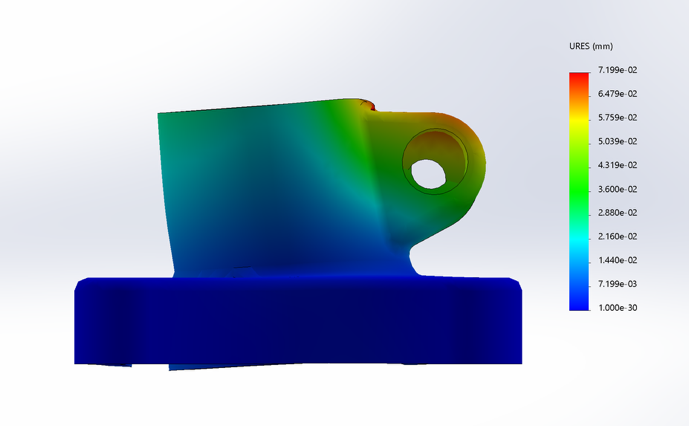

*Strain:*

<table>
<colgroup>
<col style="width: 25%" />
<col style="width: 25%" />
<col style="width: 25%" />
<col style="width: 25%" />
</colgroup>
<thead>
<tr>
<th>Name</th>
<th>Type</th>
<th>Min</th>
<th>Max</th>
</tr>
</thead>
<tbody>
<tr>
<td>Strain</td>
<td>ESTRN: Equivalent Strain</td>
<td><p>4.215e-07</p>
<p>Element: 1419</p></td>
<td></td>
</tr>
</tbody>
</table>

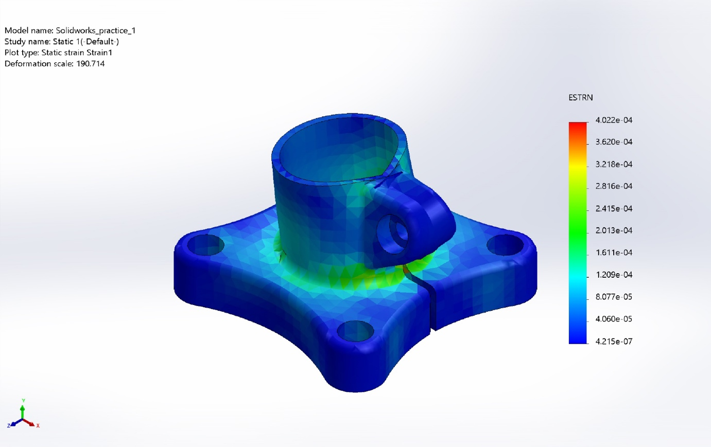

Static Stress

**<u>What we actually solved for:</u>**

> ***<u>Stress</u>**:* Stress is the internal resistance force per unit area that develops inside material when an external load is applied.  
> ``` math
> \sigma = \frac{A}{F}
> ```
>
> In structural analysis, stress represent how the applied load are distributed within the material in the study, Von Mises Stress is used as the primary stress measurement. Regions of high stress typically occurs near geometric discontinuities such as fillet, holes and sharp corners.
>
> ***<u>Strain</u>***: Strain is the measure of deformation per unit length and describes how much a material deforms under load.
>
> ​ $`\varepsilon\  = \ \frac{\mathrm{\Delta}L}{L}`$
>
> Strain is dimensionless quantity. It is directly related to the Hooke’s Law for linear elastic behaviour. In this analysis, strain indicates the extent of elastic deformation and helps identify areas experiencing significant material deformation.
>
> ***<u>Displacement</u>***: It represents the total movement of a point or region of the model from its original position due to applied loads.

**<u>Some Plots Along Specific Edges</u>**

This is the Displacement of the top edge of the ring of the model. As we can see, there is an increase, then a dip, and then another Decrease in the trend, which can also be visualised in the displacement model.


This one represents the stress experienced on the base of the tube-like section of the model, which can be visualised in the stress model photo. Almost the same, but a small stint in the middle with an increment.

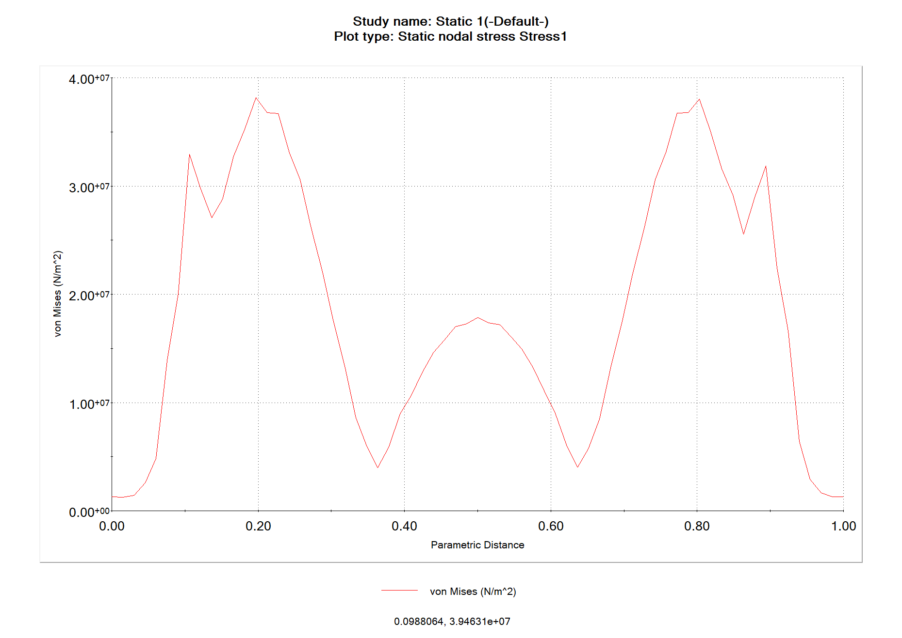

**Some Additional Photos:**

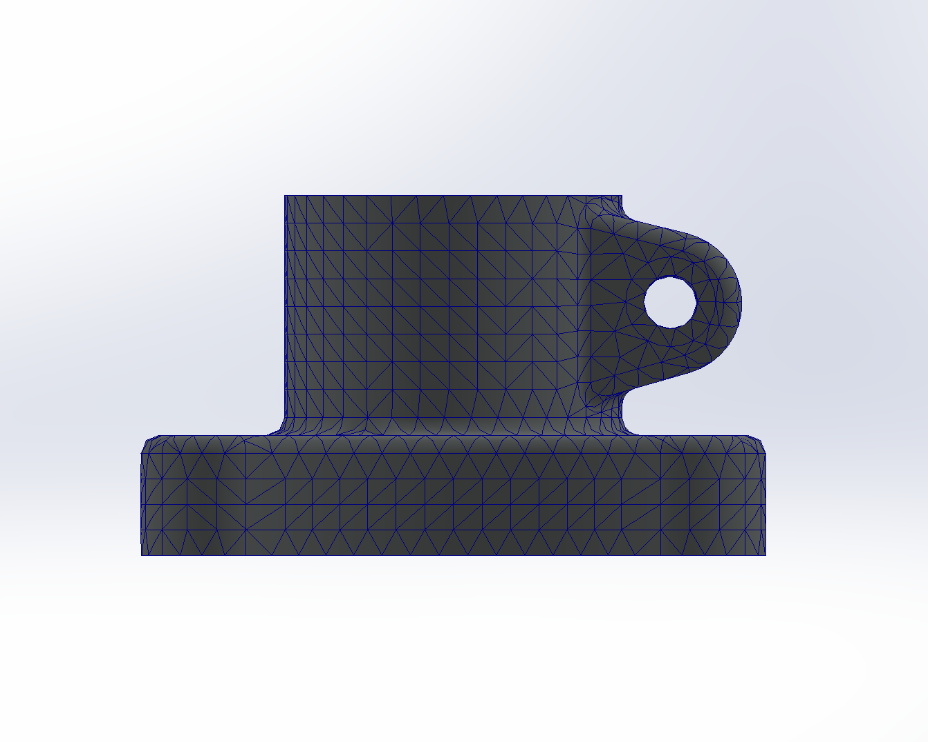

Mesh for the study

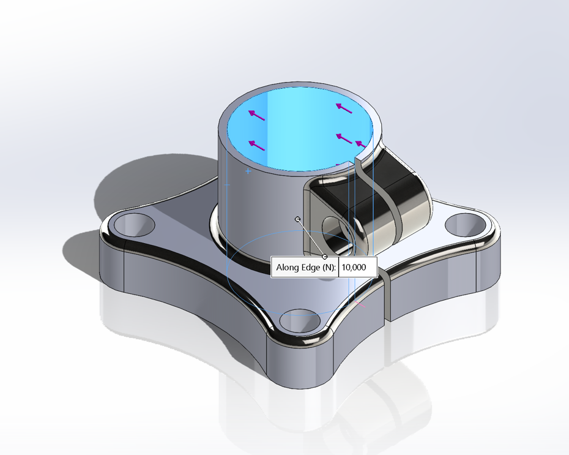

Force Direction

**<u>Conclusion</u>**

This static FEA study was a valuable and enjoyable learning experience that helped build a practical understanding of how finite element analysis works beyond theory. Creating the model, applying boundary conditions, generating the mesh, and interpreting the results made the entire process feel much more intuitive and engaging. Observing how stresses and deformations develop under static loading was particularly enlightening, as it connected classroom concepts with real simulation results. Overall, this study was not only technically informative but also genuinely fun, and it reinforced interest in further exploring FEA and simulation-based engineering in future projects.
